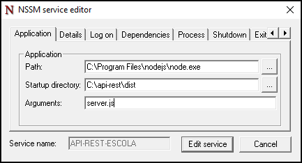
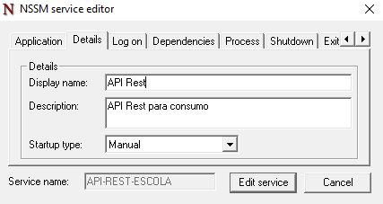

# Configurando um Serviço no Windows para uma API Node.js

Este guia descreve como configurar uma API Node.js como um serviço no Windows, utilizando o `nssm` (Non-Sucking Service Manager), garantindo que a aplicação seja executada automaticamente e disponível em uma porta específica.

## Pré-requisitos

- Node.js instalado
- A API desenvolvida em Node.js
- Acesso de administrador no Windows

## Passos para Configuração

### 1. Instalar o `nssm`

1. Baixe o `nssm` em [nssm.cc/download](https://nssm.cc/download).
2. Extraia o conteúdo do arquivo `.zip` baixado.

### 2. Criar o Serviço com `nssm`

1. Abra o **Prompt de Comando** como administrador.
2. Navegue até a pasta onde o `nssm` foi extraído, mais especificamente na pasta onde está o seu executável. Exemplo: `C:\Program Files\nssm-2.24\win64\nssm.exe`
3. Execute o seguinte comando para instalar sua API como um serviço:
   ```bash
   nssm install MinhaAPI
   ```
4. Na janela que abrir:
   - **Path**: Aponte para o executável do Node.js (geralmente em `C:\Program Files\nodejs\node.exe`).
   - **Startup directory**: O diretório onde o seu script de inicialização do servidor em uma determinada porta está localizado. Exemplo:
     ```
     C:\caminho\para\sua\aplicacao\caminho\arquivo\inicializacao
     ```
   - **Arguments**: Insira o nome do seu arquivo, por exemplo: `server.js`
   - Clique em **Install Service** para finalizar a configuração.

Exemplo de como deve ser a configuração:



Insira um nome que reconheça e único para aparecer no _Gerenciador de Serviços do Windows (services.msc)_. Coloque uma descrição caso queira também:



### 3. Configurar Variáveis de Ambiente

Certifique-se de que todas as variáveis de ambiente necessárias para a aplicação estão configuradas no sistema ou estão sendo passadas de forma adequada dentro do seu código. Uma maneira de configurar variáveis no serviço é definir variáveis globais no sistema ou passar argumentos diretamente no comando de execução.

Por exemplo, caso possua um arquivo `.env` na raíz do seu projeto, certifique-se de que esse arquivo esteja acessível.

### 4. Verificar e Iniciar o Serviço

1. Abra o **services.msc** (`Win + R`, digite `services.msc` e pressione Enter).
2. Encontre o serviço `MinhaAPI` (ou o nome que você escolheu).
3. Clique com o botão direito sobre ele e selecione "Propriedades" para ajustar as configurações de inicialização, se necessário (por exemplo, definir como `Automático`).
4. Inicie o serviço clicando com o botão direito e selecionando "Iniciar".

### 5. Testar a Disponibilidade da API

Abra um navegador e acesse `http://localhost:3001` (ou a porta configurada na sua aplicação) para verificar se a API está rodando corretamente.

## Solução de Problemas

- **O Windows não pôde iniciar o serviço...:** Verifique se todas as configurações no `nssm` estão corretas.
- **O serviço está executando, mas a aplicação não está disponível na porta configurada:** Verifique as variáveis de ambiente. Certifique-se de que todas as variáveis necessárias estão definidas corretamente.
- **Erros no Log do Windows:** Verifique o `Event Viewer` para logs específicos que possam indicar por que a aplicação não iniciou.

## Comandos Úteis

- **Editar um serviço existente:**
  ```bash
  nssm edit MinhaAPI
  ```
- **Remover um serviço:**
  ```bash
  nssm remove MinhaAPI
  ```

---

Seguindo esses passos, você terá sua API Node.js rodando como um serviço no Windows, garantindo que ela seja iniciada automaticamente e fique disponível sempre que o sistema for iniciado.
